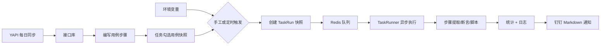

# 自动化测试平台（TP）业务与技术分析

## 1. 项目概述

本仓库是一套用 Python 实现的**接口自动化测试平台后端**。平台以「项目」为数据隔离边界，覆盖接口资产管理、用例编排、任务调度、异步执行、报告统计和钉钉通知。前端为独立应用（开发态默认 `localhost:9528`，典型 Vue Admin 端口），本仓库只提供 REST API 与静态资源。

当前能力以**接口自动化 + 定时任务**为主；UI 自动化已有元素/Widget 模型和 Selenium 依赖，但执行引擎中 `run_ui` / `get_driver` 尚未落地。

| 项 | 说明 |
| --- | --- |
| 运行时要求 | Python 3.8+（Docker 镜像为 3.9） |
| 默认端口 | `8081`（可用环境变量 `TP_PORT` 覆盖） |
| 数据隔离 | 所有业务数据挂在项目下，仅创建者、成员、管理员可见 |
| 删除策略 | 项目、环境、用例、任务等多为逻辑删除（`status=2`） |

---

## 2. 技术栈

### 2.1 核心框架与运行时

| 层级 | 技术 | 版本（requirements.txt） | 用途 |
| --- | --- | --- | --- |
| Web 框架 | Sanic | 21.3.4 | 异步 HTTP 服务、Blueprint、中间件、静态文件 |
| ORM | Tortoise ORM | 0.17.7 | 异步模型、信号、事务 |
| MySQL 驱动 | aiomysql | 0.0.21 | 生产库连接 |
| 迁移 | Aerich | 0.5.8 | 数据库 schema 迁移（`aerich.ini`） |
| HTTP 客户端 | aiohttp | 3.7.4.post0 | 接口步骤发请求、YAPI 同步、钉钉推送 |
| 密码哈希 | Werkzeug | 0.15.4 | `generate_password_hash` / `check_password_hash` |
| 加密 | cryptography / pycryptodome | 3.4.7 / 3.19.0 | AES 等工具函数 |

### 2.2 基础设施

| 组件 | 技术 | 用途 |
| --- | --- | --- |
| 缓存 / 队列 | Redis（aioredis 2.0.0b1 + redis 3.5.3） | 任务队列、调度命令、执行控制、日志落地 |
| 定时调度 | APScheduler 3.7.0（AsyncIOScheduler） | 任务 cron/interval/date 触发、每日 00:00 YAPI 同步 |
| UI 自动化（预留） | Selenium 3.141.0 | 元素定位、Widget 封装 |
| 容器 | Docker（python:3.9-buster） | 生产镜像与 `update.sh` 滚动更新 |

### 2.3 未在本仓库中的前端

后端 CORS 允许任意 Origin，认证走请求头 `Token`。前端独立部署，报告链接形如：

```
http://{HOST}/#/task/taskrun-detail?taskrun_id={id}
```

开发环境 `HOST=localhost:9528`，生产环境在 `config.py` 的 `PROD.HOST` 中配置。

---

## 3. 系统架构

### 3.1 分层结构

```
┌─────────────────────────────────────────────────────────┐
│  前端（独立 Vue 应用）                                    │
└───────────────────────────┬─────────────────────────────┘
                            │ REST + Token
┌───────────────────────────▼─────────────────────────────┐
│  Sanic App（app.py）                                      │
│  ├── middlewares: CORS、Token 鉴权                        │
│  ├── blueprints: user / project / api / case / task /    │
│  │               element                                  │
│  └── static: /media → ./media                            │
├─────────────────────────────────────────────────────────┤
│  extensions                                              │
│  ├── Tortoise ORM（MySQL / Debug 下 sqlite 配置残留）     │
│  ├── Redis 连接池                                         │
│  ├── APScheduler（多 worker 下用 SchedulerLock 选主）     │
│  ├── RedisListWorker 测试执行器                           │
│  └── Redis 日志消费者 → TaskRunLog                       │
├─────────────────────────────────────────────────────────┤
│  testrunner：Context + TaskRunner / TestRunner / StepRunner │
└─────────────────────────────────────────────────────────┘
```

### 3.2 请求生命周期

1. `OPTIONS` 预检由 CORS 中间件直接返回。
2. 路径不在白名单（`/login`、`/media`）时，从 Query `token` 或 Header `Token` 取令牌，经 `LoginRecord.token2user` 还原用户。
3. Blueprint 将请求交给 `framework.api.BaseApi.dispatch`：登录校验 → 授权 → HTTP 方法映射到 `getlist/get/post/put/patch/delete` 或自定义 `action`。
4. 统一 JSON 响应：`{ code, message, data }`，业务码见 `const.ResponseCode`（成功为 `20000`）。

### 3.3 后台 Worker

服务启动后，每个 Sanic worker 进程会挂上若干异步任务：

| Worker | Redis Key | 职责 |
| --- | --- | --- |
| 调度命令消费 | `tp:task:to_schedule` | 把 add/pause/resume/remove 等命令转给本机 APScheduler（仅拿到 `SchedulerLock` 的进程真正跑调度器） |
| 测试执行 | `tp:task:startrun:all` | 消费 `task_run_id`，驱动 `TaskRunner` |
| 执行控制 | `tp:task:control:{taskrunid}` | pause / resume / stop（含 force 取消） |
| 日志落库 | `tp:task:log:queue` | 把执行日志写入 `TaskRunLog` |

并发度：`TP_RUNNER_PER_WORKER`（默认 20），即每个 worker 同时跑的任务数上限。

### 3.4 目录职责

| 路径 | 职责 |
| --- | --- |
| `app.py` | 创建 Sanic 应用、挂扩展/中间件/蓝图、静态目录、启动入口 |
| `config.py` | DEBUG / DEV / PROD、Redis 队列名、Token、端口与 worker 数 |
| `const.py` | 业务响应码与公共响应体 |
| `blueprints/` | 按领域划分的模型与 API |
| `framework/` | 基类 Model、CRUD API、Redis Worker、WebSocket 基类 |
| `extentions/` | DB / Redis / Scheduler / Logger / Testrunner 初始化 |
| `testrunner/` | 执行上下文、步骤/用例/任务 Runner、前后钩子 |
| `po/` | Page Object：定位器 `By`、Widget 基类（UI 预留） |
| `utils/` | Token、YAPI 客户端、钉钉、变量提取、动态执行 Python |
| `migrations/` | Aerich SQL 迁移 |
| `media/` | 用例附件、任务运行时文件副本、视频目录 |

---

## 4. 业务功能逻辑

### 4.1 权限与数据隔离

- **用户角色**：普通用户 / 管理员（`User.isAdmin`）。
- **项目可见性**：管理员看全部；其他人只能看到自己创建或被分配为成员的、且 `status=1` 的项目。
- **下游资源**：环境、接口、用例、任务、元素、文件等查询都先用 `Project.filter_by_user` 收窄 `project_id`。
- **Token**：登录写入 `LoginRecord`，默认有效期 7 天，长度 200。`ALLOW_MULTI_LOGIN=True` 时允许多端；关闭则会使旧记录失效。注意：当前 `logout` 把 status 更新为 `1`，与「失效」语义不一致，属于实现缺陷。
- **密码**：明文先 MD5，再 Werkzeug 哈希存储。

### 4.2 用户与登录

| 能力 | 接口要点 |
| --- | --- |
| 登录 | `POST /login`，成功返回 token |
| 用户信息 | `GET /user/info` |
| 登出 | `POST /user/logout` |
| 用户 CRUD | `/api/user`（管理员侧用户管理） |
| 上传签名 | `POST /upload`，腾讯云 COS 风格 HMAC-SHA1 签名（依赖未在 `config.py` 中完整给出的 COS 配置） |

新建用户时同步创建默认 `UserInfo`（姓名、头像）。

### 4.3 项目管理

项目是顶层容器。创建项目后，`post_save` 信号自动建一条 `ProjectNotify`（钉钉通知配置）。

**项目操作**

- 新建：仅管理员（前端约束；后端未强制 `isAdmin`）。
- 分配成员：创建者或管理员可 `assign`，全量覆盖成员列表。
- 编辑名称/描述。
- 删除：逻辑删除。
- 通知配置：`access_token`、`secret`、是否 @所有人、@手机号列表、Markdown 报告模板。占位符在任务结束后替换为真实统计。

**环境管理**

环境属于项目，名称在项目内唯一。环境变量存在 `EnvironmentDetail`（key / value / comment）：

- 值会尝试 `json.loads`，因此数字字符串需写成 `"123"`。
- 支持 `${var}` 嵌套引用。
- `http_` 前缀变量用于初始化 `aiohttp.ClientSession`（cookies、headers、timeout 等）。
- 支持导出/导入 JSON、复制整套环境（含详情）。

执行任务时会把当时的环境详情**快照**进 `TaskRun.env_content`，后续改环境不影响已发起的运行。

### 4.4 接口管理（YAPI 同步）

平台不开放手工「新建接口」，接口主要来自 YAPI：

```
RemoteProject（同步配置）
    └── ApiCat（分类）
            └── Api（接口：方法、路径、请求体、响应等）
```

- 一个本地项目可对应多个远程 YAPI 项目（1:N）。
- 配置项：YAPI 地址、远程项目 ID/名称、Token。
- 禁用配置后不再参与同步。
- 每日 00:00 由 APScheduler 调用 `sync_all_project`：拉分类菜单 → 分页拉接口列表 → 按 `remote_api_id` 增量更新（比较 `up_time`）。
- 用例编辑地址栏时，可用路径前缀检索已同步接口并自动填充方法、头、体。
- 禁用的接口不会在测试中自动填充。

### 4.5 用例管理

**用例元数据**：标题（项目内唯一）、优先级、标签、描述、测试数据（JSON 多行）。

- 标签保存为 JSON 字符串；创建/更新时 `post_save` 会写入 `TestTag`，供任务筛选。
- 测试数据多行时，**每一行生成一次用例执行**（数据驱动）。无数据则当作一行空对象 `{}`。

**步骤模型**：`TestCaseDetail` 用链表（`next_id`）保序，支持插入、拖拽排序、删除（删除时把前驱接到后继）。

步骤类型（`classify`）：

| 类型 | 含义 | 执行方式 |
| --- | --- | --- |
| `api` | HTTP 请求 | aiohttp，Postman 风格表单 |
| `raw` | Python 脚本 | `utils.run_code` 动态编译执行 |
| `macro` | 预置脚本 | 与 raw 相同，内容来自已审核宏 |
| `ui` | UI 步骤 | 模型已预留，Runner 未实现 |

**变量解析顺序**（`${xxx}`）：

1. 当前用例测试数据 + 前面步骤提取的值（同名覆盖测试数据）
2. 脚本里 `ctx.set_global` 设置的全局变量（不覆盖当前用例局部）
3. 执行时选择的环境变量

**接口步骤**：params / headers / cookies / body（none、raw、form-data、urlencoded、binary）；提取支持正则与简化 jsonpath（`.` 取属性或下标）；断言支持环境变量与 jsonpath，比较前会 `json.loads` / `ast.literal_eval`。

**Python 步骤**：可访问 `ctx`（`testrunner.context.Context`，继承 `ChainMap`）。勾选协程则在主事件循环 `async` 执行；否则用线程池（`@AsyncWrap`）。内置 mock：`__mock_phone__`、`__mock_today__`、`__mock_timestamp__` 等。

**宏**：默认 `DISABLED`，管理员审核后才能被用例选用。修改宏会把状态打回未审核；**已引用宏的用例不会自动更新**，需在用例中重新选择保存。

**导入导出**：JSON，导入时去掉 id；项目内标题冲突记为失败项。另支持复制用例（含步骤）。

**附件**：`File` 树（目录/文件），上传按内容 SHA256 去重存到 `media/casefile`。接口 form-data/binary 可引用文件；执行时复制到 `media/taskfile`。

### 4.6 任务与执行

业务对象分层：

```
Task（任务定义）
  ├── TaskCase（选用例的快照，含步骤 JSON）
  ├── TaskScheduler（定时规则 + 环境）
  └── TaskRun（一次运行）
        ├── TaskRunCase（数据驱动的每一行）
        │     └── TaskRunCaseDetail（每一步的结果）
        └── TaskRunLog（分级日志）
```

**设计要点：快照隔离**

- 往任务里加用例时，把当时的用例+步骤写入 `TaskCase.casecontent`。
- 重新选择用例会把旧 `TaskCase` 标为 `OLD`，再插入新快照。
- 因此**运行中的任务不受后续改用例影响**；若要吃到最新用例，需「更新用例」或重新添加。

**同一任务 + 同一环境互斥**：`TaskRunLock(task_id, env_id)` 唯一约束。手工执行、定时触发、重跑都会先检查锁。

**触发方式**

1. 手工：`POST /api/task/{id}/execute`，指定 `env_id`。
2. 定时：`TaskScheduler` 的 interval / cron / date，可带时间窗口；调度器回调 `trigger_scheduler`。
3. 立即触发某条调度：`POST /api/taskscheduler/{id}/trigger`。
4. 重跑某次运行：按原任务+环境重建 `TaskRun`。

**一次运行的创建过程**（`TaskRun.create_task_run_from_task_and_env`）：

1. 读取状态为 NORMAL 的 `TaskCase`。
2. 拍环境详情快照。
3. 按测试数据行展开为多个 `TaskRunCase`（`iter_num` 为行号）。
4. 每行再展开全部步骤为 `TaskRunCaseDetail`。
5. 状态置为 `INITED`，`task_run_id` 入 Redis 队列。

**运行状态机**

```
CREATED → INITED → RUNNING ⇄ PAUSED → COMPLETED / ERROR / STOPPED
```

控制命令经 Redis List 发给正在跑该任务的 Worker：pause 置上下文标志；stop 可优雅结束或 `force` 取消 Future。

**结果汇总**：每条用例结束后用 `F(field)+1` 累加 `pass_num` / `failed_num` / `error_num` / `skip_num`。步骤失败后，同一用例后续步骤标记为 SKIPPED（「前面步骤失败或错误」）。

**钉钉通知**：`after_task_run` 钩子按项目通知配置推送 Markdown，含通过率、耗时、报告链接；可 @全部或指定手机号。

调度器自身有 `TaskSchedulerLog`，记录「手工/定时器」、初始化、入队成功或因锁冲突失败。

### 4.7 UI 元素（未完成）

`Element` 树：页面组 → 页面 → 元素 / Widget。支持 Selenium `By` 定位、相对父节点查找。`po.widgets.BaseWidget` 用子类注册机制暴露组件动作。执行侧 `Context.get_driver` 与 `StepRunner.run_ui` 仍为占位，readme 中 UI 自动化列为 TODO。

### 4.8 仪表盘

手册中预留，用于图表；本仓库无对应实现。

---

## 5. 测试执行引擎

### 5.1 上下文 `Context`

- 基于 `collections.ChainMap`：任务级环境在底层，用例数据在顶层。
- 管理：运行标志（running/paused/stop）、`aiohttp.ClientSession`、绑定到当前 task_run / case / detail 的 Logger。
- `wrap_string` 做 `${var}` 替换，并检测循环引用。
- `eval`：先 JSON 再 `literal_eval`，失败则原样返回。

### 5.2 Runner 层次

```
TaskRunner.run()
  └── 按用例标题顺序
        TestRunner.run()          # 一行测试数据
              └── StepRunner.run()  # api / raw / macro / ui
```

钩子（`testrunner/hooks.py`）在任务/用例/步骤前后写库：改状态、记时间、累加计数、关 Session、发钉钉、释放 `TaskRunLock`。

### 5.3 日志链路

`TestrunnerLoggerAdapter` 把 `task_run_id` 等打进 extra → `RedisHandler` 推入队列 → `LogWorkHandler` 写入 `TaskRunLog`。前端按任务/用例/步骤过滤查看。

---

## 6. 数据模型一览

```
User ──1:1── UserInfo
  │
  └── LoginRecord（token）

Project ──M:N── User（members）
  ├── ProjectNotify
  ├── Environment ── EnvironmentDetail
  ├── RemoteProject ── ApiCat ── Api
  ├── TestCase ── TestCaseDetail（链表）
  ├── TestTag
  ├── Macro
  ├── File（自引用树）
  ├── Element（自引用树）
  └── Task
        ├── TaskCase ── TestCase（引用 + JSON 快照）
        ├── TaskScheduler ── TaskSchedulerLog
        └── TaskRun
              ├── TaskRunCase ── TaskRunCaseDetail
              └── TaskRunLog

TaskRunLock(task, env)   运行互斥
SchedulerLock            多进程调度选主
```

通用状态枚举：`0 禁用 / 1 正常 / 2 已删除`。外键普遍 `db_constraint=False`（逻辑外键，不在数据库层强制）。

---

## 7. API 约定

`BaseApi.register(bp, name)` 自动注册四类路由：

| 模式 | 方法 | 处理 |
| --- | --- | --- |
| `/api/{name}` | GET / POST | 列表 / 创建 |
| `/api/{name}list/<action>` | GET / POST | 集合级自定义动作 |
| `/api/{name}/<pk>` | GET / PUT / PATCH / DELETE | 单资源 |
| `/api/{name}/<pk>/<action>` | 任意 | 资源级自定义动作 |

分页参数：`page`、`page_size`（默认 20）。支持 `search`、`order_by`、以及 `filter_fields` 精确过滤。

主要资源名：`user`、`project`、`environment`、`sync_config`、`api_cat`、`interface`、`testcase`、`testcasedetail`、`testtag`、`macro`、`file`、`task`、`taskscheduler`、`taskrun`、`taskruncase`、`taskruncasedetail`、`taskrunlog`、`element`。

独立路由示例：

- `POST /api/common/upload`：用例附件
- `GET /api/widget/widget_list`、`GET /api/widget/getSource`：Widget 元数据
- `GET /media/...`：静态文件

---

## 8. 部署与配置

### 8.1 配置切换

`config.py` 用模块级 `DEBUG` 选择 `DEV` 或 `PROD`：

- **DEBUG=True**：`Tortoise.generate_schemas` + `init_data()` 灌调试数据；文档写明此时应用内存 sqlite、worker 不要超过 1。当前 DEV 的 `DB_CONNECTION` 实际指向本机 MySQL，与 readme 不完全一致。
- **DEBUG=False**：生产 MySQL + 指定 Redis。

环境变量：`TP_PORT`、`TP_WORKERS`、`TP_RUNNER_PER_WORKER`。

### 8.2 本地启动

1. 安装并启动 Redis。
2. `pip install -r requirements.txt`。
3. 按需改 `config.py`。
4. `python app.py`。

### 8.3 生产

- Dockerfile：安装依赖、把 `DEBUG` 改为 False、`python app.py`。
- `update.sh`：构建镜像、固定 IP 接入 docker 网络、挂载 `media` 卷。
- 建议 Nginx 反代 `/api`、`/login`、`/user`、`/media`；`/media` 也可由 Nginx 直接提供静态文件。

数据库迁移：`aerich`，配置指向 `extentions.db.TORTOISE_ORM`。

---

## 9. 典型业务闭环



1. 管理员建项目并分配成员，配置钉钉与测试环境。
2. 配置 YAPI 同步，接口进入平台。
3. 成员编写用例：数据驱动表 + API/脚本/宏步骤。
4. 创建任务、勾选用例（生成快照），绑定环境与调度规则。
5. 触发后生成运行实例，执行器并发消费，支持暂停/继续/停止。
6. 查看报告与日志；任务结束推送钉钉。

---

## 10. 现状与缺口

**已完成**

- 项目隔离的协作与环境管理
- YAPI 接口同步与用例内检索填充
- 数据驱动用例、三类步骤（API / Python / 宏）及宏审核
- 任务快照、定时调度、并发执行、运行控制、报告统计
- 钉钉通知、用例/环境导入导出、附件

**未完成或薄弱**

- UI 自动化执行（元素模型与 Selenium 已部分存在）
- 用例调试（手册标注 TODO）
- 仪表盘、系统级配置
- WebSocket 实时推送（代码存在但未挂到 Blueprint）
- 登出未真正失效 Token；调度 `get_scheduler_kwargs` 中 cron 分支有 `kwargs.update(k, v)` 误用
- 文档与代码中的库配置（sqlite vs MySQL）不一致

---

## 11. 小结

本项目是一套 **Sanic + Tortoise + Redis + APScheduler** 的异步测试平台后端。业务上围绕「项目 → 环境/接口/用例 → 任务快照 → 异步运行 → 报告通知」闭环；技术上用 Redis List 解耦 HTTP 与执行、用快照保证运行隔离、用简化 jsonpath 与 `${}` 变量把接口测试做成可编排流水线。接口自动化与调度已可投入使用，UI 自动化与实时观测仍待补齐。
